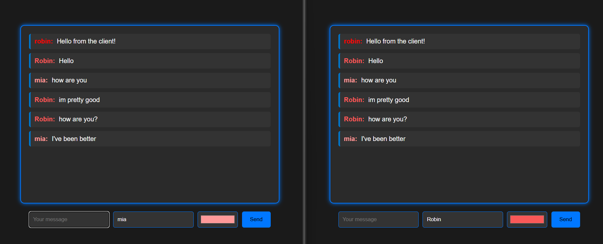

# Twitch Chat-Like WebSocket Application

This project implements a Twitch chat-like application using Go for the WebSocket server and SolidJS for the frontend. The server receives messages from connected clients without broadcasting them back to the channels. The frontend emulates a Twitch chat interface where users can send messages.

  

## Features

- WebSocket server implemented in Go

- Real-time message reception

- Twitch chat-like interface

- SolidJS for reactive and fast frontend development

## Requirements

- Go 1.16 or later

- Node.js 14.x or later

- npm or yarn

- gorilla/websocket Go package

- solid-js and solid-app-router npm packages
## Example
